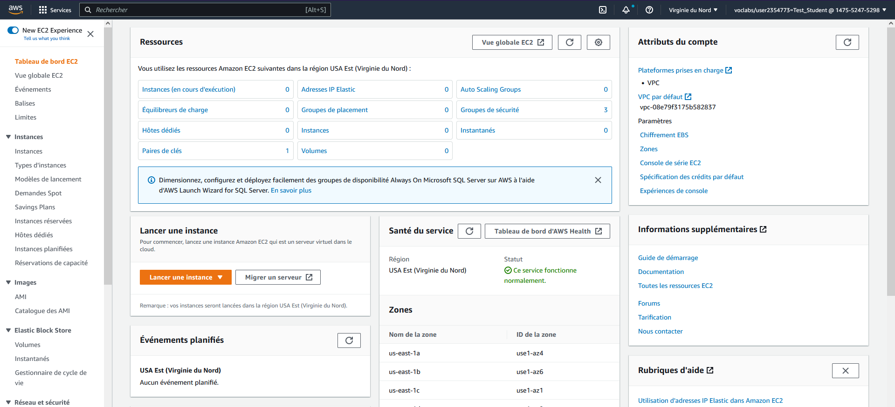
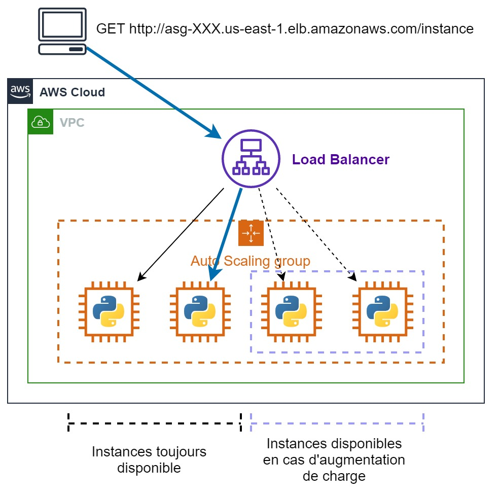

# TP 1 - Instances EC2 , Auto Scaling Group et Load Balancer

## Préambule

Ce TP prend la forme d'un tutoriel. Il vous suffit de suivre les étapes à votre rythme pour arriver à la fin. Tout est expliqué et il peut être fait en autonomie sans difficulté. Le but est de vous familiariser avec la plateforme AWS et de réaliser des tâches simples. Comme vous allez le constater rapidement, AWS n'est pas une plateforme *beginner friendly*. Il y a beaucoup d'étapes et de configurations à réaliser pour lancer un service même simple. Pendant le TP, mettez-vous par groupe de 3 à 4 pour vous entraider et avancer quand je ne suis pas disponible.

Une dernière chose, le TP est probablement trop long pour être réalisé en une seule séance. Si cela arrive, il sera continué lors de la séance suivante.

👩‍💻👨‍💻Happy coding!

## Connexion à la console AWS

1. Connectez-vous à la plateforme AWS Academy : https://www.awsacademy.com avec les identifiants que vous avez créés, puis sélectionnez le cours.
2. Cliquez sur `Modules`, puis sur `Learner Lab`.
3. Ensuite, cliquez sur `Start Lab`. Une fois le lab lancé (pastille verte à gauche), cliquez sur `AWS Details` et `Download PEM`. Cela va télécharger la clé privée qui permettra d'établir des connexions SSH pendant le TP.
4. Enfin, cliquez sur `AWS`.

🎉 Vous voilà connecté(e) à la console AWS!

## Ma première instance EC2

1. Dans la barre de recherche en haut cherchez `EC2` et cliquez sur le service. Vous arriverez sur une page similaire à la page ci-dessous : 

   

2. Cliquez sur `Lancer une instance` pour arriver sur l'écran de création de votre première instance EC2.

   - **Nom et balise** : donnez un nom à votre instance. Exemple : Ma première instance

   - **Images d'applications et de systèmes d'exploitation (Amazon Machine Image)** : c'est ici que vous allez choisir le système d'exploitation de votre machine. Choisissez une machine `Ubuntu` et laissez la version 24.04 sélectionnée par défaut.

   - **Type d'instance** : regardez les différents types d'instances disponibles. Par défaut, l'instance t2.micro est sélectionnée. C'est une petite instance avec 1 vCPU (~1 cœur) et 1 Go de RAM qui conviendra parfaitement pour le TP. La famille des instances "t" est destinée à un usage général, et elles peuvent, en cas de besoin, se voir allouer plus de CPU (mais le prix augmentera). Mais si vous le souhaitez, vous pouvez choisir une t3.xlarge (4 vCPU, 16 Go de RAM, 0,16$/h) ou même une c6in.xlarge (32 vCPU, 64 Go de RAM, 1,8$/h). Si vous voulez simplement essayer, ne prenez pas une machine avec plus de 32 vCPU.

     > 🧙‍♂️ La taille de la machine n'affectera pas les performances du TP, vous pouvez laisser le type par défaut.

   - **Paire de clés (connexion)** : sélectionnez la clé `vockey`. Ce paramètre définit quelle clé SSH sera reconnue par la machine. Ce paramètre est obligatoire si l'on souhaite se connecter en SSH à une instance.

   - **Paramètres réseau** : cette configuration permet de déterminer dans quel réseau et sous-réseau se trouvera votre machine, si elle sera accessible depuis internet et les règles de pare-feu. Par défaut, votre instance sera placée dans le réseau de votre compte, dans un sous-réseau public. Cochez la case `Autoriser le trafic HTTP depuis l'Internet`. Cela rendra notre webservice accessible depuis internet.

     > 🧙‍♂️ AWS est une plateforme qui doit permettre à une équipe IT de recréer toute une architecture physique dans le cloud. Il y a donc beaucoup de paramètres qui ne sont pas du ressort d'un data scientist. En résumé, tout cela permet de sécuriser un système d'information en empêchant l'accès depuis l'extérieur à certaines machines (comme les bases de données) et de segmenter un gros système en zones isolées pour limiter les risques d'intrusion.

   - **Stockage (volumes)** : laissez le paramètre par défaut. Votre machine aura un volume EBS (~un disque dur) de 8 Go.

3. Une fois cela fait, vous pouvez lancer votre instance en cliquant sur `Lancer l'instance`. Après quelques secondes, un écran indiquant que le lancement est réussi devrait apparaître. Cliquez sur `Afficher toutes les instances`.

4. Une fois sur le tableau de bord de vos instances, cliquez sur l'ID de votre instance pour accéder à son tableau de bord, puis copiez son `Adresse IPv4 publique`.

5. Vous allez maintenance vous connecter à votre instance.

   **Ubuntu** : ouvrez le terminal avec un `Ctrl+Alt+T`, puis
   ```
   cd .\Téléchargements
   ssh -i "labsuser.pem" ubuntu@[adresseIPv4]
   ```
   en remplaçant `[adresseIPv4]` par l'adresse de votre instance. Entrez `yes` à la question qui vous sera posée.

   **Windows** : ouvrez un powershell (barre de chercher>powershell) et faites

   ```
   cd .\Downloads
   ssh -i "labsuser.pem" ubuntu@[adresseIPv4]
   ```
   en remplaçant `[adresseIPv4]` par l'adresse de votre instance. Tapez `yes` à la question qui vous sera posée.

   **MacOs** : ouvrez le terminal et allez dans votre dossier contenant votre clé téléchargement. Puis faites
   ```
   ssh -i "labsuser.pem" ubuntu@[adresseIPv4]
   ```

   en remplaçant `[adresseIPv4]` par l'adresse de votre instance. Tapez `yes` à la question qui vous sera posée.

   Votre terminal devra se remplir de texte et terminer par un prompt commençant par `ubuntu@XXXXX`

   🎉Félicitation vous venez de créer une machine virtuelle et de vous y connecter !

6. Maintenant clonez le dépôt du TP avec la commande `git clone https://github.com/HealerMikado/Ensai-CloudComputingLab1.git` et installez tous les outils nécessaires pour faire fonctionner le webservice :

   - `sudo apt update` : pour mettre à jouer les dépôts de paquets. Cela permet à votre machine de savoir ce qu'elle peut installer
   - `sudo apt install python3-pip`: pour installer pip. Python est déjà présent sur la machine mais pas pip
   - `sudo apt install python3.12-venv`: pour installer le module venv python
   - `cd Ensai-CloudComputingLab1` : pour vous placer dans le répertoire du webservice
   - `python3 -m venv venv` : pour créer un environnement virtuel
   - `source venv/bin/activate` : pour activer l'environnement viruel
   - `sudo pip3 install -r requirements.txt` : pour installer les dépendances python
   - `sudo venv/bin/python app.py` : pour lancer finalement le webservice depuis votre venv

   > 🧙‍♂️`sudo` permet de lancer une commande en mode "super utilisateur"  ou "root" (= administrateur dans le monde windows). Les commandes de type `apt` sont toujours lancées en root.

   Ouvrez un navigateur web ou Insomnia sur votre ordinateur et faite une requête à la page `http://[adresseIPv4]/task` en remplaçant `[adresseIPv4]` par l'adresse IPv4 de votre instance. Vous devrez arriver sur une page contenant 3 éléments.

7. Maintenant, vous allez arrêter votre instance. Sur la page de l'instance, cliquez sur `État de l'instance` > `Arrêter l'instance`. Attendez quelques instants et rafraîchissez la page. Normalement, elle devrait afficher `Arrêté(e)` comme état et ne plus avoir d'adresse `DNS IPv4 Public`. Vérifiez que votre webservice n'est plus accessible.

8. Redémarrez votre instance en cliquant sur `État de l'instance` > `Démarrer l'instance`. Vérifiez les adresses publiques de votre instance, elles devraient avoir changé ! Connectez-vous à votre instance comme précédemment, mais assurez-vous d'utiliser la nouvelle adresse. Une fois connecté à l'instance, exécutez `ls` (listing) pour vérifier que le dossier du webservice est toujours présent, puis `cd Ensai-CloudComputingLab1` pour vous placer dans le dossier. Comme l'instance a été arrêtée, vous devez relancer le webservice, mais comme toutes les dépendances ont été installées, il suffit de saisir `python3 app.py`. Accédez à votre webservice en utilisant la nouvelle adresse publique de votre machine.

9. Maintenant, vous allez simplement redémarrer votre machine via l'option `Redémarrer l'instance`. Le redémarrage sera presque instantané, et il n'y aura aucun gros changement dans le tableau de bord. Cependant, vous devrez relancer votre webservice qui a été arrêté lors du processus.

   > 🧙‍♂️ Lorsque vous arrêtez votre machine, AWS libère les ressources associées. Lorsque vous la redémarrez, AWS peut déployer votre machine sur un autre serveur, d'où le changement d'adresse publique. En revanche, lorsqu'une machine est redémarrée, AWS effectue simplement un redémarrage, sans libérer les ressources. C'est pourquoi c'est plus rapide et que l'adresse publique reste la même.

10. Votre machine ne sera plus utile, alors résiliez-la. La résiliation consiste à supprimer totalement une machine. C'est une action destructive qui peut entraîner une perte de données.

## Ma première flotte d'instances ⛵⛵⛵

Le but de cette partie est de gérer une flotte d'instance via un *Auto Scaling Group* et de rendre accessible cette flotte via un point d'entrée unique qui s'appelle un *Load Balancer*. Le *Load Balancer* va répartir la charge entre les différentes machines pour éviter de surcharger une machine en particulier. Voici architecture que vous allez construire : 



1. Sur le panneau de gauche, cliquez sur `Modèles de lancement` dans la rubrique `Instances`. Une fois sur la page des modèles, cliquez sur `Créer un modèle de lancement`.

2. La page de création de modèle est extrêmement similaire à celle de la création d'une instance. Mais cette fois-ci, vous allez seulement créer un plan qui permettra de créer des instances toutes identiques.
   - **Nom du modèle** : modele-webservice
   - **Images d'applications et de systèmes d'exploitation (Amazon Machine Image)** : cliquez sur Démarrage rapide, puis sélectionnez Ubuntu.
   - **Type d'instance** : prenez une t2.micro pour cet exercice.

   - **Paire de clés (connexion)** : sélectionnez la clé `vockey`.

   - **Paramètres réseau** : laissez le paramètre du sous-réseau par défaut. Cela signifie que ce modèle ne fixe pas le sous-réseau à utiliser. Pour le pare-feu, sélectionnez `launch-wizard-1`, qui correspond à celui qui a été créé lors de la première partie du TP.

   - **Stockage (volumes)** : laissez le paramètre par défaut. Votre machine aura un volume EBS (~un disque dur) de 8Go.

   - **Détails avancés** : allez en bas de la page jusqu'à l'option `Données utilisateur`. Saisissez le texte suivant:

     ```bash
      #!/bin/bash
      apt update
      apt install -y python3-pip python3.12-venv
      git clone https://github.com/HealerMikado/Ensai-CloudComputingLab1.git
      cd Ensai-CloudComputingLab1
      python3 -m venv venv
      source venv/bin/activate
      pip3 install -r requirements.txt
      venv/bin/python app.py
     ```
     
     > Ce sont les mêmes commandes que vous avez fait précédemment, mais sans le sudo car par défaut le script de lancement est exécuté en super user.

   Validez la création de votre modèle. 

3. Une fois votre modèle créé, dans le menu de gauche, cherchez `Groupes Auto Scaling` (c'est la dernière option), puis une fois sur la page des *Groupes Auto Scaling*, cliquez sur `Créer un groupe Auto Scaling`.

   1. Donnez le nom que vous souhaitez à votre groupe, par exemple `ASG-webservice`. Pour le modèle de lancement, choisissez le modèle que vous venez de créer. Cliquez sur `Suivant`.

   2. Dans la partie réseau, sélectionnez au moins 2 sous-réseaux, mais vous pouvez tous les sélectionner si vous le souhaitez. Cliquez sur `Suivant`.

      > 🧙‍♂️ Chacun de ces sous-réseaux est situé dans un datacenter différent. Utiliser au moins 2 sous-réseaux assure que si un datacenter tombe, nous aurons des machines toujours accessibles. Cela n'arrivera pas pendant le TP, mais c'est une chose à prendre en compte dans le monde professionnel.

   3. Sélectionnez l'option `Attacher un nouvel équilibreur de charge`. Vous pouvez modifier le nom si vous le souhaitez. Sélectionnez comme schéma de l'équilibreur de charge `Internet-Facing`. Dans la partie `Écouteur de routage`, cliquez sur `Sélectionner un groupe cible nouveau ou existant`, puis sur `Créer un groupe cible`. Cela va associer votre *Auto Scaling Group* au *Load Balancer*. Cliquez sur `Suivant`.

   4. Pour la taille du groupe, saisissez les valeurs suivantes :

      - Capacité souhaitée : 2
      - Capacité minimale : 2
      - Capacité maximale : 4

      Cliquez sur l'option `Politique de suivi des objectifs et d'échelonnement` et laissez la valeur par défaut. Nous venons de configurer un groupe d'instances qui va commencer avec 2 instances et pourra avoir entre 2 et 4 instances. Si AWS détecte que l'utilisation globale du CPU dépasse 50 %, AWS va créer une nouvelle instance. Cliquez sur `Passer à la vérification`.

   5. Descendez au bas de la page et cliquez sur `Créer un groupe Auto Scaling`.

2. Maintenant, votre *Auto Scaling Group* est créé, retournez sur le tableau de bord des instances EC2. Vous devriez voir que vous avez 2 instances en cours de lancement. Dans un autre onglet, allez sur le tableau de bord `Équilibreurs de charge` et trouvez votre *Load Balancer*. Cliquez dessus et copiez son `Nom DNS`. Dans un troisième onglet, accédez à l'URL `[Nom DNS de l'équilibreur de charge]/instance`. Rafraîchissez la page plusieurs fois. Vous devriez constater que l'ID retourné oscille entre deux valeurs, celles des instances EC2 de votre tableau de bord.

3. Sur le tableau de bord EC2, résiliez une instance. Attendez quelques instants (environ 2 minutes), et vous devriez voir qu'automatiquement une nouvelle instance est démarrée pour respecter notre règle de 2 instances au minimum.

4. Connectez-vous à une instance et exécutez la commande suivante : `while : ; do : ; done`. Cette commande bloque votre instance et lance une boucle infinie composée de l'instruction null `:`, ce qui sature le CPU de la machine. Attendez quelques minutes et de nouvelles instances vont être lancées automatiquement pour maintenir l'utilisation globale du CPU à 50 %. Vous pouvez arrêter la commande avec `Ctrl+C` et après une dizaine de minutes, le nombre d'instances diminuera. Comme la réduction de votre flotte prend plus de temps, vous aurez du mal à voir cela en TP.

Félicitations, vous venez en quelques clics de déployer une architecture simple et efficace qui s'adapte à la charge et qui est hautement disponible car répartie sur deux datacenters. L'architecture que vous venez de créer est dite **hautement disponible** et **élastique**. En d'autres termes, elle est capable de s'adapter à la charge en augmentant ou en diminuant le nombre de machines (élasticité), mais aussi elle continuera à fonctionner en cas de panne massive (haute disponibilité). Il manque encore une base de données à notre application pour le moment pour qu'elle soit réellement intéressante. Nous verrons plus tard dans le cours comment associer un code python à une base de données hébergée sur AWS.
