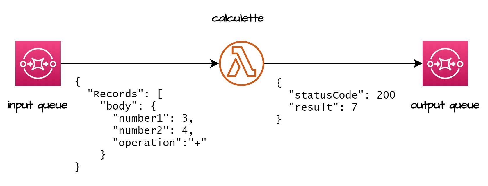

# TP 3 - Lambda 🚄

## 🧱 Mise en place

Allez sur la plateforme AWS Academy et accédez au cours AWS Academy Learner Lab [43226]. Puis cliquez sur `Modules` > `Learner Lab`. Lancez votre environnement en cliquant sur `Start Lab`. Une fois le cercle passé au vert, cliquez sur `AWS Details` et `AWS CLI`. Les clefs que vous voyez vont permettre un accès programmatique à votre compte. Cherchez le dossier `.aws` sur votre machine puis remplacez le contenu du fichier `credentials` par les clefs que vous venez de récupérer.

## Ma première Lambda

### 📄 Définition de la Lambda

Une fois sur la console AWS, cherchez le service `Lambda` dans la barre de recherche. Sur le tableau de bord Lambda, cliquez sur `Créer une fonction`. Laissez l'option `Créer à partir de zéro` cochée, donnez un nom à votre fonction Lambda, et pour le langage d'exécution sélectionnez `python3.9`. Conservez l'architecture x86_64, et dépliez `Modifier le rôle d'exécution par défaut`, sélectionnez `Utiliser un rôle existant` et sélectionnez le rôle `LabRole`. Créez votre fonction.

> 🧙‍♂️ À la différence des instances EC2, une fonction Lambda a besoin d'un rôle pour fonctionner. Sans entrer dans les détails, un rôle va déterminer les droits de la fonction. Comme votre compte n'a pas le droit de création de rôle, vous ne pouvez pas créer un rôle à la volée, et il faut sélectionner le rôle `LabRole` déjà créé.

Une fois sur la page de votre fonction, un code de base est proposé par AWS. Ce code retourne simplement un code 200 et le texte `Hello from Lambda!`. Vous allez lancer cette fonction via le bouton `Test`. Créez un nouvel événement de test, que l'on va appeler `test_basique`, et laissez le JSON de base. Votre événement de test sera un simple JSON de la forme :

```json
{
  "key1": "value1",
  "key2": "value2",
  "key3": "value3"
}
```

Enregistrez-le et cliquez de nouveau sur `Test`. Normalement, tout devrait bien se passer.

Maintenant, vous allez légèrement modifier la fonction. Au lieu de simplement retourner une chaîne de caractères fixe, elle va retourner l'heure actuelle. Importez la classe `datetime` du module éponyme et utilisez le code `datetime.now().strftime("%m/%d/%Y, %H:%M:%S")` pour avoir l'heure et la date du jour sous forme de chaîne de caractères. Comme votre fonction a été modifiée, il faut la redéployer avec le bouton `Deploy`. Une fois fait, testez-la de nouveau pour voir si tout fonctionne.

###  Ajout de l'invocation toutes les minutes

Sur la page de votre Lambda, cliquez sur `+ Ajouter un déclencheur`. La source va être `EventBridge`. Créez une nouvelle règle avec le nom `minuteur`. Le type de règle sera `Expression de planification` et l'expression `rate(1 minute)`.

> 🧙‍♂️ EventBridge permet de gérer les événements comme des alarmes quand un seuil est dépassé, mais aussi les événements planifiés.

Votre fonction sera désormais appelée toutes les minutes. Malheureusement, comme il n'y a pas de destination pour votre fonction, les résultats disparaissent dans le néant du cloud. Il est toutefois possible de voir qu'elle est invoquée en allant sur l'onglet `Surveiller` puis `Journaux`. Vous allez voir une ligne par minute, mais comme notre fonction ne log rien, vous n'allez voir aucun résultat.

> 🧙‍♂️ Il est possible d'ajouter un logger (utile pour le debug) en faisant des `print()` (ce n'est pas idéal), ou en utilisant le module `logging`.
>
> ```python
>import os
> import logging
> logger = logging.getLogger()
> logger.setLevel(logging.INFO)
> 
> def lambda_handler(event, context):
>  logger.info('## ENVIRONMENT VARIABLES')
>  logger.info(os.environ)
>     logger.info('## EVENT')
>     logger.info(event)
>    ```
>    
> 

### ⚒️ Automatiser ce déploiement

En vous aidant du code disponible ici https://github.com/HealerMikado/Ensai-CloudComputingLab3, créez un script terraform pour automatiser ce déploiement.

### 💨Poussez les résultats dans une file SQS

Maintenant, vous allez faire en sorte que votre fonction envoie ses résultats dans une file SQS. Cherchez le service SQS et créez une file. Elle sera du type Standard et donnez-lui le nom que vous souhaitez. Gardez toutes les valeurs par défaut et créez votre file. Copiez l'URL de la file.

Retournez sur la page de votre Lambda et modifiez le code pour publier dans la file SQS en vous aidant du code suivant :

```python
import json
import boto3
from datetime import datetime
sqs = boto3.client('sqs')  #client is required to interact with sqs

def lambda_handler(event, context):
    # event provenant d'une lambda
    data = int(json.loads(event["Records"][0]["body"])["data"])

    sqs.send_message(
        QueueUrl="VOTRE URL SQS",
        MessageBody=json.dumps({"body" : data})
    )
    return {
        'statusCode': 200,
        'body': data
    }
```

Déployez la nouvelle fonction, puis attendez quelques minutes. Ensuite, retournez sur la page de votre file SQS et cliquez sur `Envoyer et recevoir des messages`, puis sur `Rechercher des messages`. Vous devriez voir des messages apparaître. Cliquez sur l'un d'eux et vous devriez voir votre message.

🎉 Félicitations ! Vous venez de mettre en place une architecture 100% serverless qui va réaliser un traitement toutes les minutes et pousser le résultat dans une file pour être utilisé par un autre service par la suite. Même si le code Python du traitement est assez simple, l'architecture elle ne l'est pas. Vous pourriez par exemple, avec ce système, faire une requête toutes les heures à un web service pour mettre à jour des données en base.

## 🧮Une calculatrice

Maintenant vous allez réaliser une calculatrice en utilisant une fonction lambda. Voici le schema d'architecture globale. 




Vous allez devoir créer :

- Deux files SQS, une pour l'input et une pour l'output.
- Une fonction Lambda qui va aller chercher les clés `number1`, `number2` et `operation` et faire le calcul demandé. Les opérations que l'on souhaite faire sont l'addition, la soustraction, la multiplication et la division.

Le déclencheur de la fonction lambda passe des paramètres dans le dictionnaire `event`. Pour obtenir la clé `number1`, vous devez faire `float(json.loads(event["Records"][0]["body"])["number1"])`.

> 🧙‍♂️ Pour vous aider à comprendre ce code, les messages récupérés par la lambda sont dans la clé `Records`. SQS n'envoie pas les messages à la fonction lambda, c'est la fonction qui les pull. Sauf qu'elle peut en récupérer plusieurs à la fois, et la clé `Records` est une liste. Pour simplifier, on ne regarde que le premier message, d'où le `event["Records"][0]`. Si vous avez envie, vous pouvez boucler sur les éléments de la liste. Ensuite, chaque message est contenu dans la clé `body`. Les messages sont considérés comme des strings car il n'y a aucune raison que ce soit un JSON, donc il nous faut le transformer en dictionnaire avec un `json.loads()`. Enfin, il est possible de récupérer les clés que l'on souhaite. Attention à leur type ! Il faut spécifier que les nombres sont bien des nombres.

Pour tester votre application, vous pouvez :

- Faire un test via l'onglet test de la fonction lambda avec le JSON suivant :

```
{
  "Records": [
    {
      "messageId": "bc8007e9-6a6d-41d4-ba09-2fcf16e5e6c3",
      "receiptHandle": "AQEB92BoJQllWCtZSiiIQ69fXXX4ac7cpxxcbTirw4/b+ziBTzAxlwXFMbj3w6wbOPom4jPusM9453dZDXi4iVH/vf97fFk6yg/EkP9UZRYrK5OwfWiIxQJkklWe8ZKK84uYVhGIDi5kBfWTCnsX6u83+GE59g/UWc0+jbYvOArOLwCCOTRqbH3spkG/GhDHlyxVwPv/K+xNM+7pqQX21yjSQdiLwwlk7dDJwiNGatRq9D1vIDHduabmHn2I1sLrq778ZkZXS4YJ6IYeFXC+kWVYlSy+lXyVxHfxBVXQcU8PsSNv6MsoBDgjU1LD43NFikQLVI5F/+HnBEX2AzhoJPBMz/eijKW1miJNZ48G9gg2H2DOt0x2OQtg2M2VqtxROmD06gHUPsr67vvBH2J5m77Oxw==",
      "body": "{\n\"number1\":1,\n\"number2\":5,\n\"operation\":\"+\"\n}",
      "attributes": {
        "ApproximateReceiveCount": "18",
        "SentTimestamp": "1681393246569",
        "SenderId": "AROAZ2UVGELJYYC7FJZIV:user2476414=__tudiant_test",
        "ApproximateFirstReceiveTimestamp": "1681393246569"
      },
      "messageAttributes": {},
      "md5OfBody": "cb76cceb2fbc7622690cdf4f256ea8e0",
      "eventSource": "aws:sqs",
      "eventSourceARN": "arn:aws:sqs:us-east-1:675696485075:lab-input-queue",
      "awsRegion": "us-east-1"
    },{
      "messageId": "bc8007e9-6a6d-41d4-ba09-2fcf16e5e6c3",
      "receiptHandle": "AQEB92BoJQllWCtZSiiIQ69fXXX4ac7cpxxcbTirw4/b+ziBTzAxlwXFMbj3w6wbOPom4jPusM9453dZDXi4iVH/vf97fFk6yg/EkP9UZRYrK5OwfWiIxQJkklWe8ZKK84uYVhGIDi5kBfWTCnsX6u83+GE59g/UWc0+jbYvOArOLwCCOTRqbH3spkG/GhDHlyxVwPv/K+xNM+7pqQX21yjSQdiLwwlk7dDJwiNGatRq9D1vIDHduabmHn2I1sLrq778ZkZXS4YJ6IYeFXC+kWVYlSy+lXyVxHfxBVXQcU8PsSNv6MsoBDgjU1LD43NFikQLVI5F/+HnBEX2AzhoJPBMz/eijKW1miJNZ48G9gg2H2DOt0x2OQtg2M2VqtxROmD06gHUPsr67vvBH2J5m77Oxw==",
      "body": "{\n\"number1\":1,\n\"number2\":5,\n\"operation\":\"+\"\n}",
      "attributes": {
        "ApproximateReceiveCount": "18",
        "SentTimestamp": "1681393246569",
        "SenderId": "AROAZ2UVGELJYYC7FJZIV:user2476414=__tudiant_test",
        "ApproximateFirstReceiveTimestamp": "1681393246569"
      },
      "messageAttributes": {},
      "md5OfBody": "cb76cceb2fbc7622690cdf4f256ea8e0",
      "eventSource": "aws:sqs",
      "eventSourceARN": "arn:aws:sqs:us-east-1:675696485075:lab-input-queue",
      "awsRegion": "us-east-1"
    }
  ]
}
```


- Créez un message dans la queue d'input et voyez si le résultat apparaît dans la queue d'output. Voici un exemple de message :

  ```
  {"number1":1,"number2":5,"operation":+}
  ```

🎉 Félicitations, vous venez de mettre en place une architecture 100% serverless avec trois services qui communiquent entre eux. Mettre des files entre des services permet de découpler les services et d'avoir un système plus modulable. Par exemple, dans notre cas, notre lambda ne sait pas d'où proviennent les données, elle sait juste les prendre depuis une file. Ainsi, la source des données peut changer, du moment que la nouvelle source alimente la file SQS, il n'y aura pas de raison de changer la lambda. De la même manière, notre lambda ne se préoccupe pas du service qui va utiliser les données qu'elle produit. Elle les dépose simplement dans une file pour qu'un consommateur puisse les récupérer. Les files SQS agissent comme des zones tampons entre les services.

S'il vous reste du temps pendant le TP, commencez le TP noté.